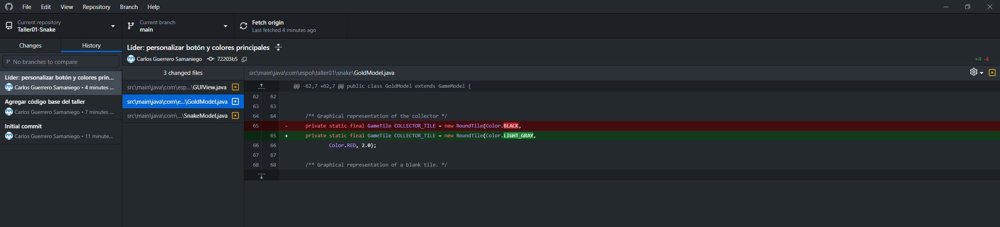
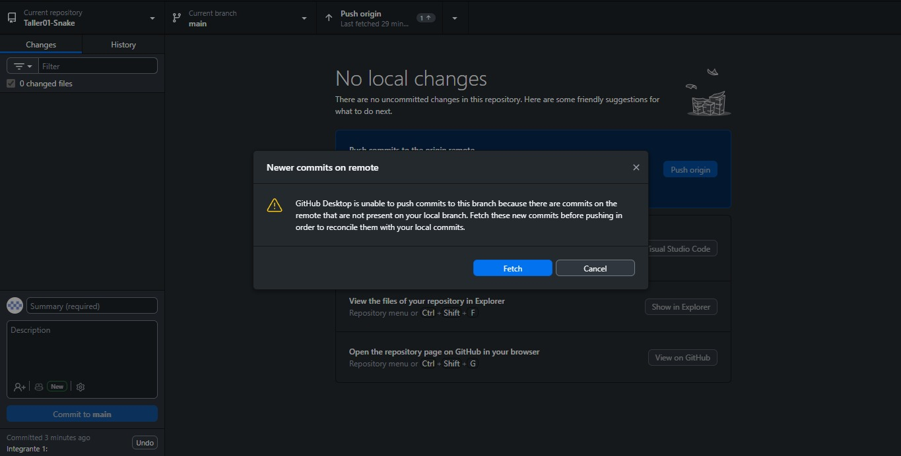
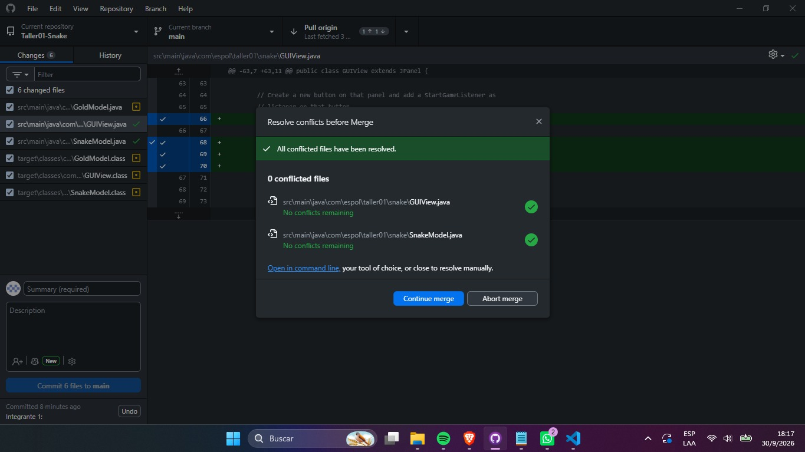
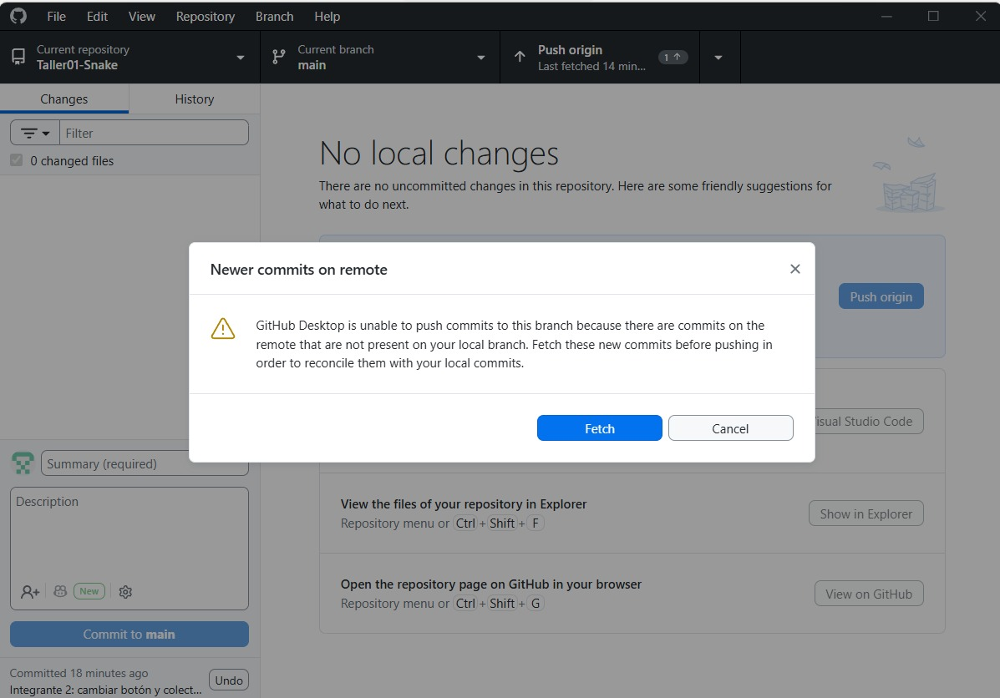
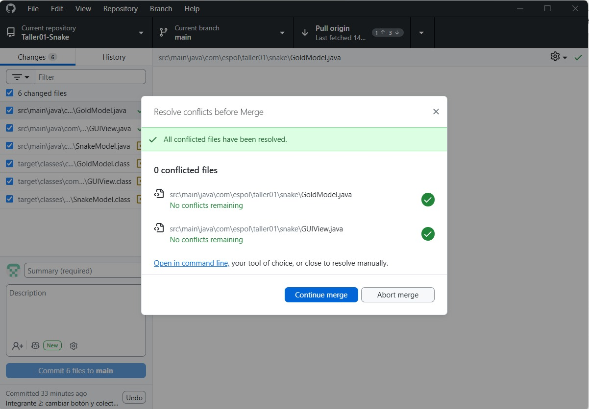

# Taller01-Snake

## Integrantes y roles


| Rol | Nombre | Usuario de GitHub | Commit principal |
| --- | --- | --- | --- |
| Líder | Carlos Guerrero | CguerreroS07 | personalizar botón y colores principales  |
| Integrante 1 | Victor Ponce | VicPon76 | Cambiar el nombre del boton y el color |
| Integrante 2 | Ashley Recalde | AshleyR012 | cambiar botón y colector de gold  |


## Evidencias


```markdown
### Líder

Push exitoso:



### Integrante 1

Error antes de resolver conflicto:



Push exitoso después de resolver conflicto:



### Integrante 2

Error antes de resolver conflicto:



Push exitoso después de resolver conflicto:


```